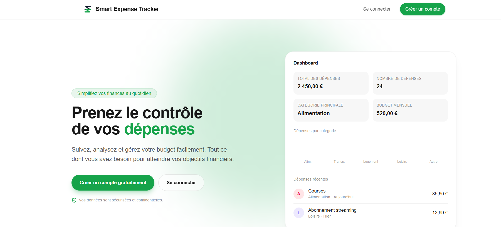
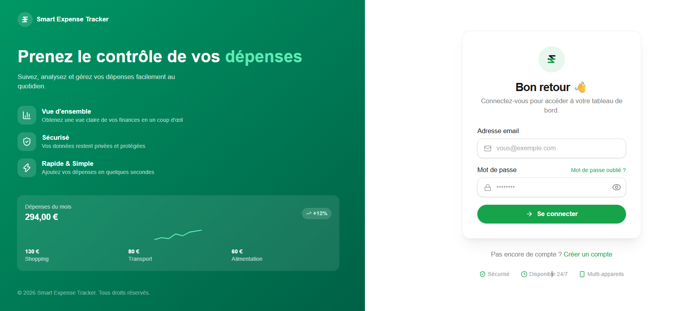
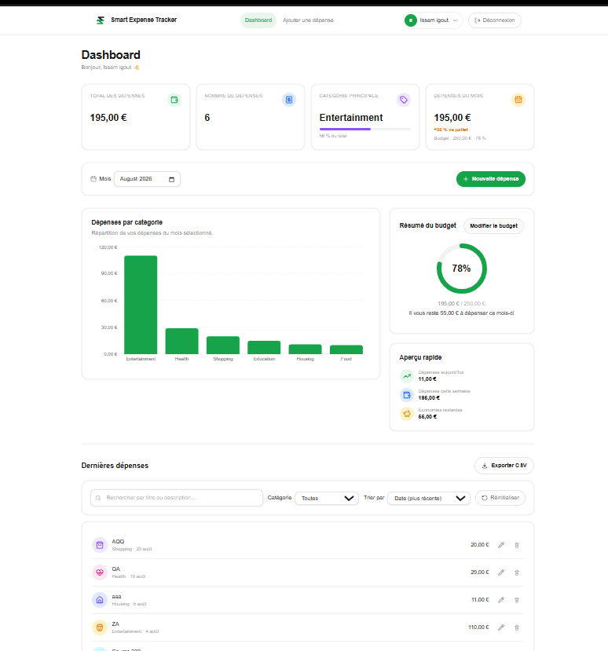

# Smart Expense Tracker

Application web moderne de gestion de dépenses personnelles, construite avec Next.js (App Router) et Supabase.

## Table des matières

1. [Aperçu du projet](#1-aperçu-du-projet)
2. [Démonstration](#2-démonstration)
3. [Points forts du projet](#3-points-forts-du-projet)
4. [Fonctionnalités](#4-fonctionnalités)
5. [Stack technique](#5-stack-technique)
6. [Captures d'écran](#6-captures-décran)
7. [Architecture](#7-architecture)
8. [Choix techniques](#8-choix-techniques)
9. [Structure du projet](#9-structure-du-projet)
10. [Base de données](#10-base-de-données)
11. [Authentification](#11-authentification)
12. [Sécurité](#12-sécurité)
13. [Installation](#13-installation)
14. [Variables d'environnement](#14-variables-denvironnement)
15. [Exécution en local](#15-exécution-en-local)
16. [Scripts disponibles](#16-scripts-disponibles)
17. [Tests](#17-tests)
18. [Déploiement](#18-déploiement)
19. [Améliorations futures](#19-améliorations-futures)
20. [🤖 Développement assisté par IA](#20--développement-assisté-par-ia)
21. [Auteur](#21-auteur)

---

## 1. Aperçu du projet

Smart Expense Tracker permet à un utilisateur de suivre ses dépenses personnelles au quotidien : ajouter, modifier et supprimer des dépenses, les classer par catégorie, définir un budget mensuel et visualiser sa consommation grâce à un dashboard et un graphique.

Le projet a été conçu avec une priorité claire : **simplicité, robustesse et sécurité**, plutôt que l'accumulation de fonctionnalités. Chaque dépendance et chaque abstraction a été ajoutée uniquement lorsqu'elle était réellement nécessaire.

## 2. Démonstration

- **Application** : à compléter
- **Dépôt GitHub** : à compléter

## 3. Points forts du projet

- **Sécurité multicouche** : Row Level Security au niveau de la base de données, doublée d'une vérification systématique côté serveur (`supabase.auth.getUser()`) avant toute opération sensible.
- **Validation partagée** : les mêmes schémas Zod valident les formulaires côté client et les payloads reçus par les Route Handlers — jamais de confiance aveugle dans les données du client.
- **Logique métier testée** : les fonctions de calcul pures (résumé des dépenses, statut du budget, comparaison mensuelle) sont couvertes par des tests unitaires Vitest, indépendamment de Supabase.
- **Architecture Next.js idiomatique** : Server Components par défaut, `"use client"` réservé aux composants qui en ont réellement besoin.
- **Aucune dépendance superflue** : modales natives `<dialog>`, système de notifications toast fait maison, export CSV généré sans librairie.
- **Typage strict de bout en bout** : TypeScript en mode strict, aucun `any`, types partagés entre le modèle de données, la validation et l'affichage.

## 4. Fonctionnalités

| Domaine | Détail |
|---|---|
| Authentification | Inscription, connexion, déconnexion, gestion de session, mot de passe oublié / réinitialisation, protection des pages privées, redirection automatique selon l'état de connexion |
| Dépenses | Ajout, modification, suppression et consultation de la liste des dépenses |
| Catégories | 8 catégories fixes : Food, Transport, Housing, Shopping, Entertainment, Health, Education, Other |
| Dashboard | Total des dépenses, nombre de dépenses, catégorie principale, dépenses du mois sélectionné |
| Graphique | Répartition des dépenses par catégorie |
| Budget mensuel | Définition d'un budget par mois, montant restant, pourcentage utilisé (un seul budget par utilisateur et par mois) |
| Comparaison mensuelle | Évolution des dépenses par rapport au mois précédent (hausse, baisse, stable, nouveau) |
| Recherche et filtres | Recherche par titre/description, filtre par catégorie, tri (date, montant, titre), réinitialisation des filtres |
| Export | Export CSV des dépenses affichées |
| UX | États de chargement, d'erreur et vide gérés sur chaque section ; notifications toast ; application entièrement responsive (mobile, tablette, desktop) |

## 5. Stack technique

| Catégorie | Technologie | Rôle |
|---|---|---|
| Framework | Next.js 16 (App Router) | Rendu, routage, Server Actions, Route Handlers |
| Langage | TypeScript (strict mode) | Typage statique fort |
| UI | Tailwind CSS v4 | Style utilitaire |
| Icônes | Lucide React | Icônes SVG |
| Graphiques | Recharts | Graphique de répartition par catégorie |
| Validation | Zod | Schémas de validation partagés formulaires / API |
| Base de données | Supabase (PostgreSQL) | Stockage des dépenses et des budgets |
| Authentification | Supabase Auth (`@supabase/ssr`) | Comptes, sessions, protection des routes |
| Tests | Vitest | Tests unitaires de la logique métier et des schémas Zod |
| Déploiement | Vercel | Hébergement cible |

## 6. Captures d'écran

> Emplacements réservés — images à ajouter dans `docs/screenshots/`.

| Page d'accueil | Connexion |
|---|---|
|  |  |

| Dashboard | Formulaire de dépense |
|---|---|
|  |  |

## 7. Architecture

```
Navigateur (client)
        │
        ▼
Next.js App Router
 ├─ Server Components   → pages rendues côté serveur (dashboard, landing, auth...)
 ├─ Server Actions      → inscription, connexion, déconnexion, mot de passe
 └─ Route Handlers      → /api/expenses, /api/expenses/[id],
                          /api/expenses/export, /api/budgets/[month]
        │
        ▼
Supabase
 ├─ Auth        → gestion des utilisateurs et des sessions
 └─ PostgreSQL  → tables "expenses" et "monthly_budgets",
                  protégées par Row Level Security
```

Le middleware Next.js (`proxy.ts`) rafraîchit la session à chaque requête et protège les routes privées avant même que la page ne s'exécute.

## 8. Choix techniques

- **Modales natives `<dialog>`** (confirmation de suppression, formulaire de budget) plutôt qu'une librairie de modales : focus trap et fermeture par la touche Échap gérés nativement par le navigateur, zéro dépendance.
- **Système de notifications toast fait maison** (React Context + `useState`) plutôt qu'une librairie externe : le besoin restait assez simple pour ne pas justifier une dépendance supplémentaire.
- **Fonctions de calcul pures et testables** (`computeSummary`, `computeBudgetStatus`, `computeMonthlyComparison`) séparées de l'affichage, sans effet de bord.
- **Export CSV généré manuellement** (échappement des champs, BOM UTF-8) sans librairie dédiée.
- **Zod comme unique couche de validation**, réutilisée entre les formulaires client et les Route Handlers.
- **Row Level Security comme véritable frontière de sécurité**, doublée de vérifications côté serveur avant toute opération sensible plutôt que de faire confiance au seul contrôle applicatif.
- **Server Components par défaut** ; `"use client"` réservé aux composants ayant réellement besoin d'état, d'effets ou d'événements utilisateur.

## 9. Structure du projet

```
smart-expense-tracker/
├── app/
│   ├── api/
│   │   ├── budgets/[month]/route.ts
│   │   └── expenses/
│   │       ├── route.ts
│   │       ├── [id]/route.ts
│   │       └── export/route.ts
│   ├── auth/callback/route.ts
│   ├── dashboard/
│   │   ├── layout.tsx
│   │   ├── page.tsx
│   │   └── expenses/
│   │       ├── new/page.tsx
│   │       └── [id]/edit/page.tsx
│   ├── login/page.tsx
│   ├── signup/page.tsx
│   ├── forgot-password/page.tsx
│   ├── reset-password/page.tsx
│   ├── layout.tsx
│   └── page.tsx
├── components/
│   ├── auth/            # Formulaires d'authentification
│   ├── dashboard/        # Composants du tableau de bord (résumé, budget, filtres, liste...)
│   ├── landing/          # Composants de la page d'accueil
│   └── toast/            # Système de notifications
├── lib/
│   ├── actions/          # Server Actions (auth)
│   ├── api/              # Helpers de réponse API
│   ├── expenses/         # Logique métier pure (résumé, budget, comparaison, mois, CSV) + tests
│   ├── validation/        # Schémas Zod (dépense, budget, auth) + tests
│   └── supabase/         # Clients Supabase (serveur) et accès aux variables d'environnement
├── types/                # Types TypeScript partagés (Expense, MonthlyBudget)
├── supabase/
│   └── schema.sql        # Schéma SQL de référence (tables + RLS)
├── proxy.ts               # Rafraîchissement de session et protection des routes
├── next.config.ts
└── vitest.config.mts
```

## 10. Base de données

Deux tables PostgreSQL, chacune liée à `auth.users` (géré par Supabase Auth) et protégée par Row Level Security.

```
auth.users (géré par Supabase Auth)
        │ id
        │
   ┌────┴─────────────────────┐
   │                           │
   ▼                           ▼
expenses                  monthly_budgets
─────────────────────     ─────────────────────
id            uuid PK     id            uuid PK
user_id       uuid FK     user_id       uuid FK
title         text        month         text  ('YYYY-MM')
amount        numeric >0  amount        numeric >0
category      text        created_at    timestamptz
expense_date  date        updated_at    timestamptz
description   text (opt.)
created_at    timestamptz UNIQUE (user_id, month)
```

**Contraintes principales** (voir [`supabase/schema.sql`](supabase/schema.sql)) :

- `expenses.amount` et `monthly_budgets.amount` doivent être strictement positifs.
- `expenses.category` est restreinte aux 8 catégories fixes.
- `expenses.description` est optionnelle, limitée à 500 caractères.
- `monthly_budgets.month` doit respecter le format `YYYY-MM`.
- `monthly_budgets` impose une contrainte unique sur `(user_id, month)` : un seul budget par mois et par utilisateur.

## 11. Authentification

- Basée sur `@supabase/ssr` et `@supabase/supabase-js`.
- Flux couverts : inscription, connexion, déconnexion, mot de passe oublié et réinitialisation.
- La session est rafraîchie et vérifiée à chaque requête via `proxy.ts`, qui protège les routes `/dashboard/**` et redirige les utilisateurs déjà connectés hors des pages `/login` et `/signup`.
- Toute décision de sécurité côté serveur repose sur `supabase.auth.getUser()` (jamais `getSession()`), vérifié à nouveau dans les pages elles-mêmes en plus du middleware (défense en profondeur).

## 12. Sécurité

- **Row Level Security** activée sur `expenses` et `monthly_budgets`, avec quatre politiques par table (lecture, création, modification, suppression), toutes restreintes à `auth.uid() = user_id`.
- Un utilisateur ne peut donc jamais accéder aux données d'un autre utilisateur — la restriction est appliquée au niveau de la base de données, pas uniquement côté application.
- **Validation Zod systématique**, à la fois dans les formulaires (retour immédiat à l'utilisateur) et dans les Route Handlers (source de vérité finale côté serveur).
- La clé `service_role` de Supabase n'est **jamais** utilisée ni exposée côté client ; seule la clé publique (`publishable`) l'est.
- Les identifiants transmis dans les URL (UUID) sont validés avant toute requête vers la base de données.

## 13. Installation

```bash
git clone <url-du-dépôt>
cd smart-expense-tracker
npm install
```

## 14. Variables d'environnement

Créer un fichier `.env.local` à la racine du projet avec les variables suivantes :

| Variable | Description |
|---|---|
| `NEXT_PUBLIC_SUPABASE_URL` | URL du projet Supabase |
| `NEXT_PUBLIC_SUPABASE_PUBLISHABLE_KEY` | Clé publique (publishable) du projet Supabase |

> Ces valeurs se trouvent dans les paramètres API du projet Supabase. La clé `service_role` ne doit jamais être utilisée dans ce projet.

## 15. Exécution en local

Prérequis : Node.js et un projet Supabase configuré (voir [Base de données](#10-base-de-données) pour le schéma à appliquer via le SQL Editor de Supabase).

```bash
npm run dev
```

L'application est alors disponible sur [http://localhost:3000](http://localhost:3000).

## 16. Scripts disponibles

| Commande | Description |
|---|---|
| `npm run dev` | Démarre le serveur de développement |
| `npm run build` | Build de production |
| `npm run start` | Démarre le serveur en mode production (après `build`) |
| `npm run lint` | Analyse statique du code (ESLint) |
| `npm run test` | Lance Vitest en mode watch |
| `npm run test:run` | Lance la suite de tests une seule fois |
| `npm run test:coverage` | Lance les tests avec rapport de couverture |

## 17. Tests

Les tests unitaires utilisent [Vitest](https://vitest.dev) et se concentrent sur la logique qui peut être testée sans dépendance externe :

- **Fonctions métier pures** : `lib/expenses/summary.ts`, `budget.ts`, `comparison.ts`, `month.ts`, `csv.ts`.
- **Schémas de validation Zod** : `lib/validation/expense.ts`, `budget.ts`, `signup.ts`, `login.ts`.

Ne sont volontairement **pas** couverts par cette suite : Supabase (Auth et requêtes réseau), les Route Handlers et les composants React.

```bash
npm run test:run
```

## 18. Déploiement

Le projet est prévu pour être déployé sur [Vercel](https://vercel.com). Les mêmes variables d'environnement que celles listées en [section 14](#14-variables-denvironnement) doivent être configurées dans les paramètres du projet Vercel.

## 19. Améliorations futures

Fonctionnalités volontairement laissées de côté à ce stade, pour privilégier la simplicité du projet actuel :

- Conseils basés sur l'IA à partir des habitudes de dépense
- Dépenses récurrentes
- Notifications
- Mode sombre avancé

## 20. 🤖 Développement assisté par IA

Cette section s'adresse à un recruteur technique et vise à expliquer honnêtement comment des outils d'IA ont été utilisés pendant le développement de ce projet : comme assistants dans un processus de développement rigoureux, encadré et relu à chaque étape — jamais comme un outil générant l'application de façon automatique.

### Workflow de développement

#### 1. Analyse du besoin

Chaque fonctionnalité démarre par une phase de compréhension avant toute ligne de code :

- compréhension précise de la fonctionnalité demandée ;
- définition claire de son périmètre (ce qui est inclus, ce qui ne l'est pas) ;
- réflexion sur les cas limites (erreurs, valeurs vides, permissions, concurrence…).

#### 2. Préparation

ChatGPT est utilisé en amont de l'implémentation, principalement pour :

- analyser le besoin ;
- réfléchir à l'architecture envisageable ;
- préparer des prompts structurés et sans ambiguïté ;
- challenger les choix techniques avant de les valider ;
- préparer la documentation (comme ce README) ;
- préparer les entretiens techniques autour du projet.

#### 3. Implémentation

Claude Code est utilisé pour l'implémentation à proprement parler, principalement pour :

- comprendre le projet existant avant de le modifier ;
- ne modifier que les fichiers réellement concernés par la demande ;
- implémenter les fonctionnalités validées en amont ;
- effectuer des refactorings ciblés ;
- proposer des améliorations précises, sans étendre le périmètre de sa propre initiative.

Chaque plan d'implémentation est **validé explicitement avant toute modification de code** — jamais d'exécution automatique d'un plan non relu.

#### 4. Relecture

Chaque modification produite est relue manuellement avant d'être considérée comme terminée, en vérifiant :

- la qualité générale du code ;
- la correction des types TypeScript ;
- la sécurité (permissions, validation, exposition de données) ;
- les performances ;
- la cohérence avec l'architecture déjà en place.

#### 5. Validation

Chaque fonctionnalité n'est considérée comme terminée qu'après :

- `npm run lint` ;
- l'exécution des tests unitaires concernés ;
- un build de production réussi ;
- la correction de toute erreur constatée à l'une de ces étapes.

#### 6. Git

Les commits ne sont réalisés qu'une fois la fonctionnalité entièrement validée — jamais en cours de développement ni avant relecture.

### Pourquoi utiliser plusieurs outils IA ?

Chaque outil a des points forts différents, utilisés de façon complémentaire plutôt qu'interchangeable.

| Outil | Utilisé principalement pour |
|---|---|
| ChatGPT | Analyser un problème, réfléchir à une architecture, préparer des prompts de qualité, expliquer des concepts techniques, préparer la documentation |
| Claude Code | Comprendre le dépôt existant, modifier plusieurs fichiers de façon cohérente, implémenter les fonctionnalités, effectuer des refactorings, naviguer efficacement dans le projet |

L'objectif de cette séparation n'est **pas uniquement de réduire la consommation de tokens**. Il est surtout de :

- limiter le contexte inutile transmis à chaque outil ;
- améliorer la précision des réponses obtenues ;
- garder des conversations courtes, centrées sur une seule fonctionnalité à la fois ;
- faciliter la revue du code généré.

### Exemple de workflow

```
Besoin
   │
   ▼
Analyse (ChatGPT)
   │
   ▼
Architecture
   │
   ▼
Prompt final
   │
   ▼
Claude Code
(implémentation)
   │
   ▼
Revue manuelle
   │
   ▼
Tests
   │
   ▼
Git
```

### Exemple de prompt

Exemple représentatif d'un prompt réellement utilisé pendant le développement de ce projet (phase d'ajout du budget mensuel) :

```text
Nous ajoutons maintenant uniquement la gestion du budget mensuel.

Lis entièrement CLAUDE.md avant toute modification.

Objectifs :

- ajouter un budget mensuel par utilisateur ;
- conserver l'architecture actuelle ;
- ne pas modifier le CRUD des dépenses ;
- ne pas modifier l'authentification.

Contraintes :

- ne pas installer de nouvelle dépendance ;
- ne pas modifier l'interface dans cette phase ;
- ne pas exécuter de commande Git.

Avant toute modification :

1. lister les fichiers concernés ;
2. expliquer le flux des données ;
3. expliquer les impacts sur la base de données ;
4. attendre ma validation explicite.
```

## 21. Auteur

- **Nom** : à compléter
- **GitHub** : à compléter
- **LinkedIn** : à compléter
